## Projeto-Azure-AI-Services

## Imagem 4.0 com AI Vision Service

Os recursos incluem:

- [x] Personalizacao de modelo
- [x] Ler texto de images
- [x] Detectar pessoas em images

## Home - Microsoft Azure

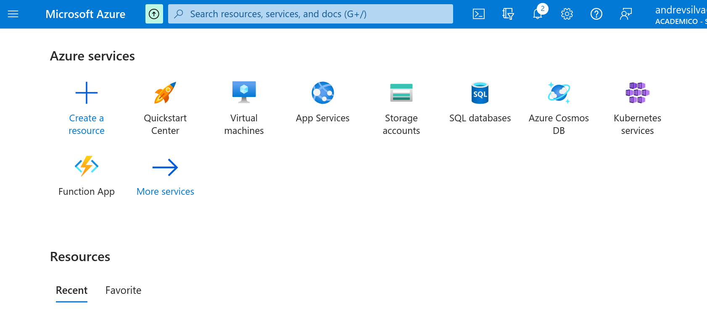

## All Services - AI Machine Learning

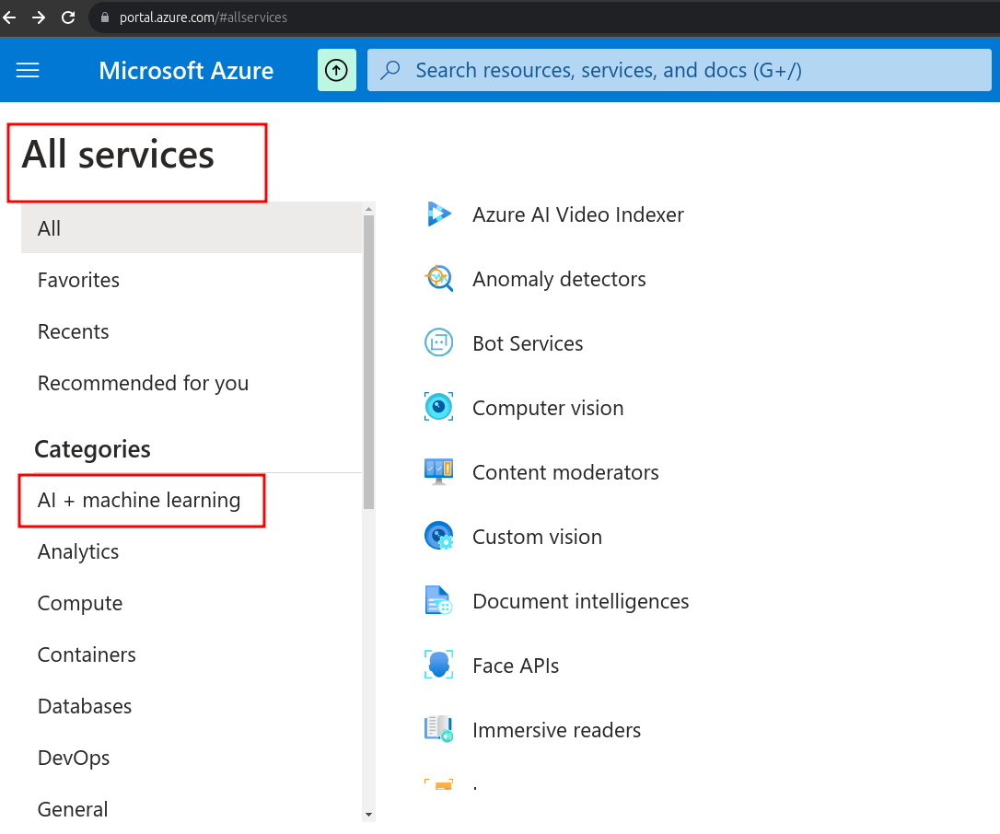

## Azure AI services

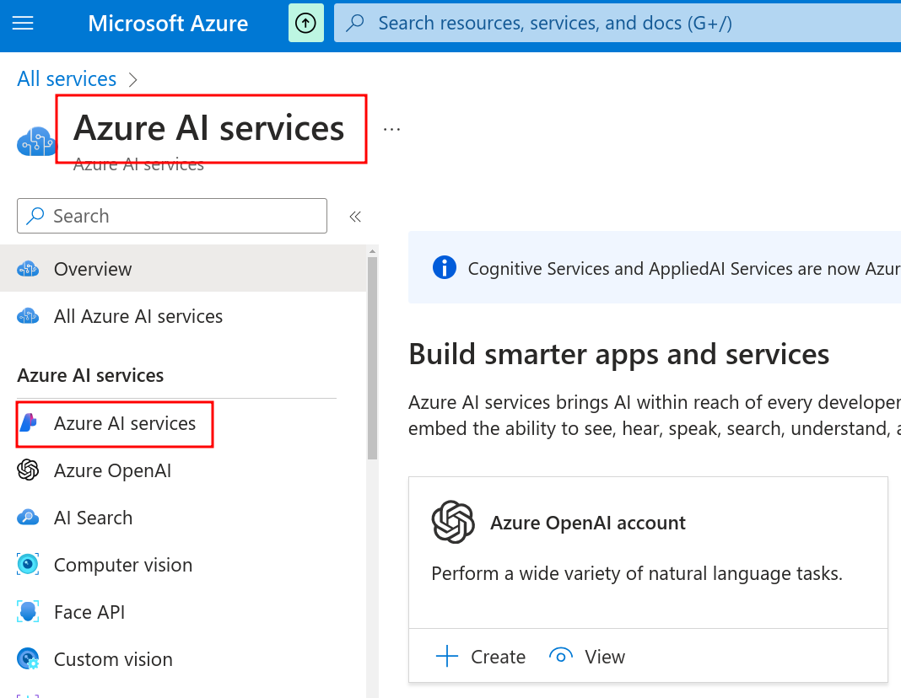

Clicar em create!

Depois definir todas as configurações

Ir para o site: [Portal Vision Cognitive Azure](https://portal.vision.cognitive.azure.com/gallery/face)

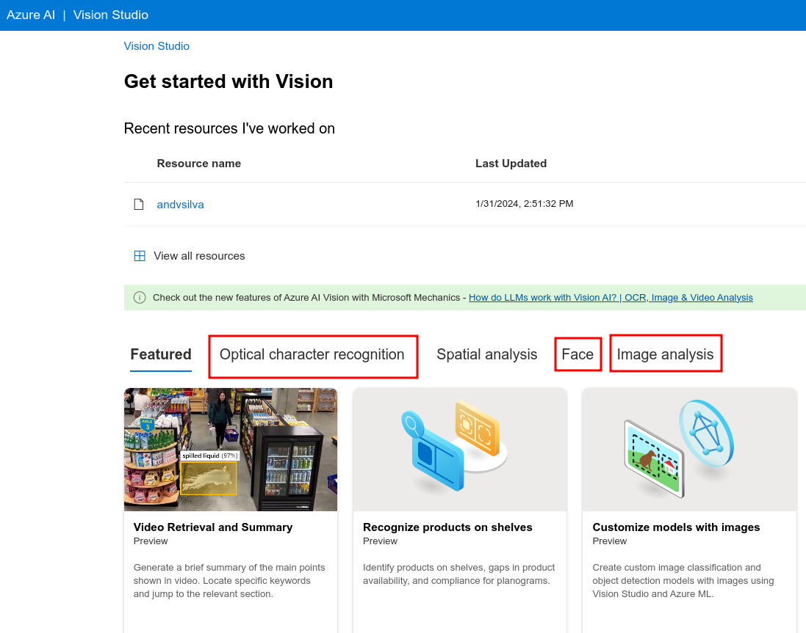

## Detectar rostos em uma imagem

- [View Documentation](https://learn.microsoft.com/en-us/azure/ai-services/computer-vision/concept-face-detection)
- [View samples on Github](https://learn.microsoft.com/en-us/azure/ai-services/computer-vision/quickstarts-sdk/identity-client-library?tabs=linux%2Cvisual-studio&pivots=programming-language-csharp)

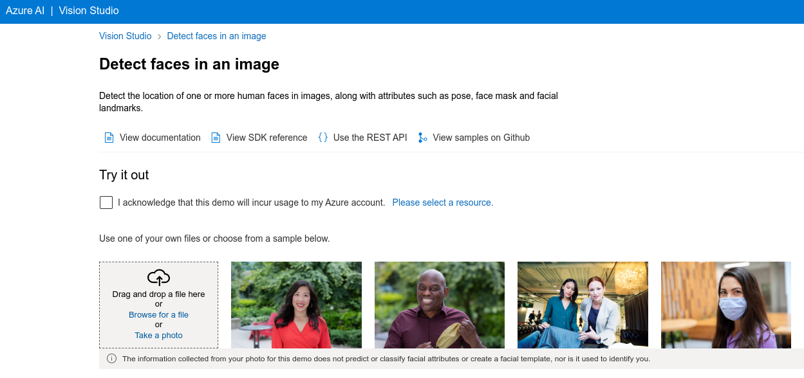

### Exemplos:

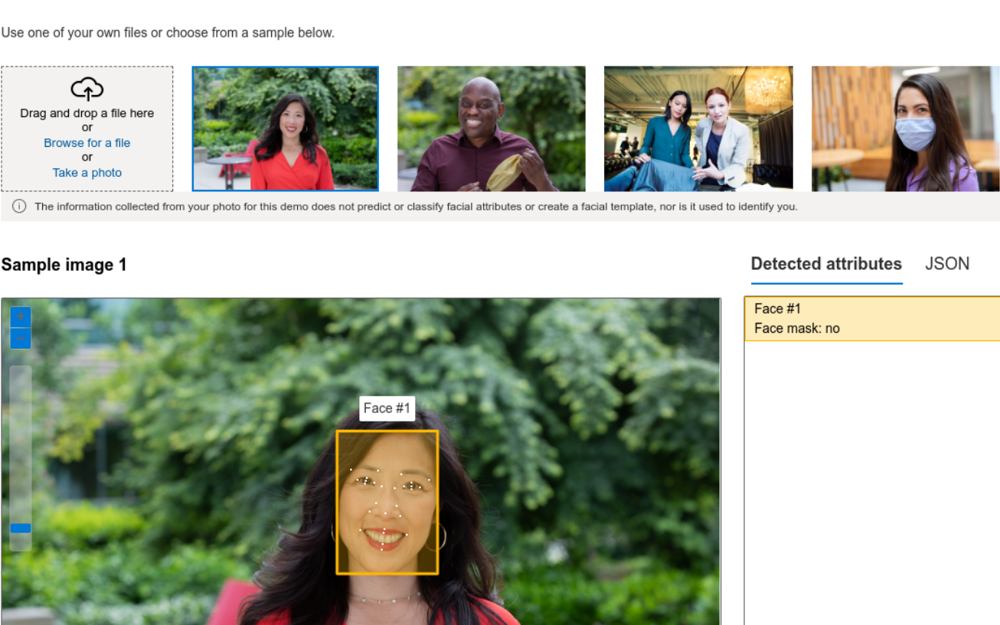

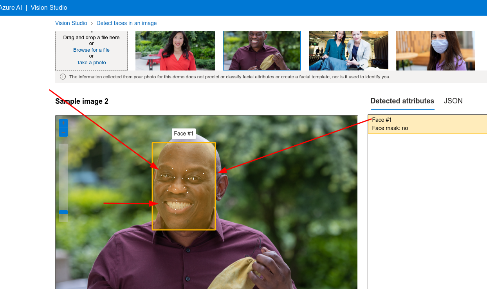

## Extrair texto de imagens

- [OCR for images (version 4.0)](https://learn.microsoft.com/en-us/azure/ai-services/computer-vision/concept-ocr)
- [Language support for Azure AI Vision](https://learn.microsoft.com/en-us/azure/ai-services/computer-vision/language-support)

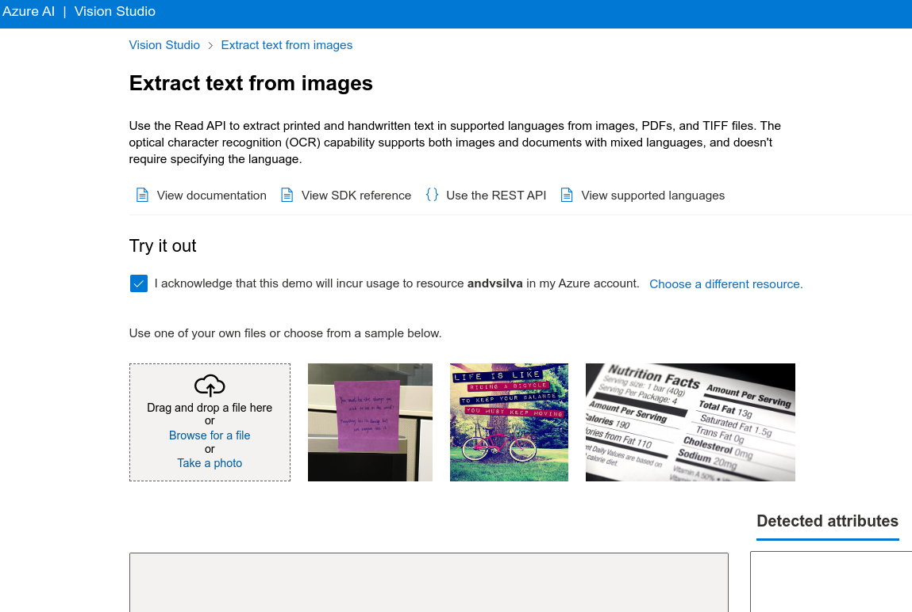

### Exemplos:

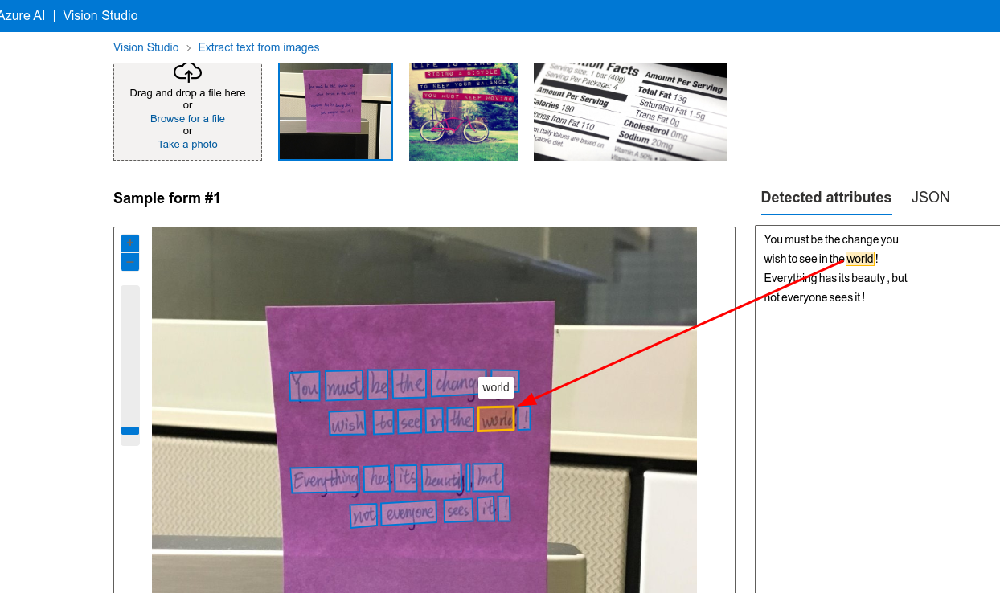

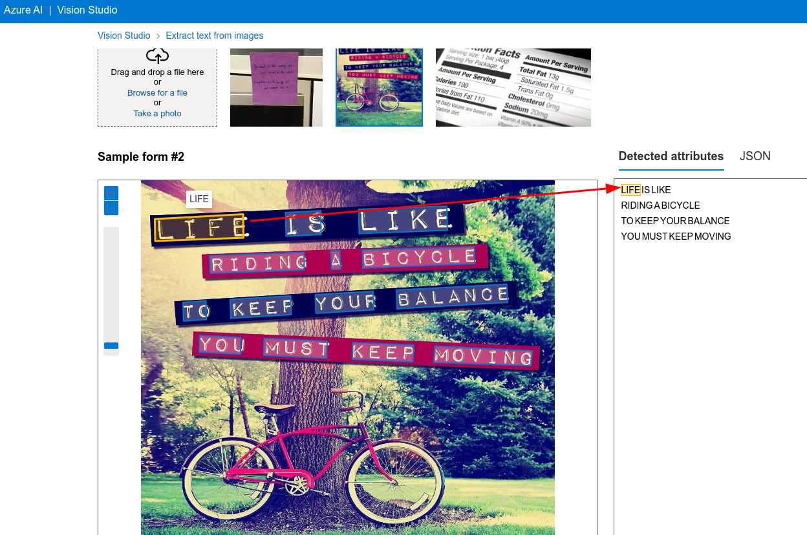

## Adicionar legendas às imagens

-[Image captions (version 4.0)](https://learn.microsoft.com/en-us/azure/ai-services/computer-vision/concept-describe-images-40?tabs=image)
-[Azure AI Vision SDK (Preview) Samples - Github](https://github.com/Azure-Samples/azure-ai-vision-sdk)

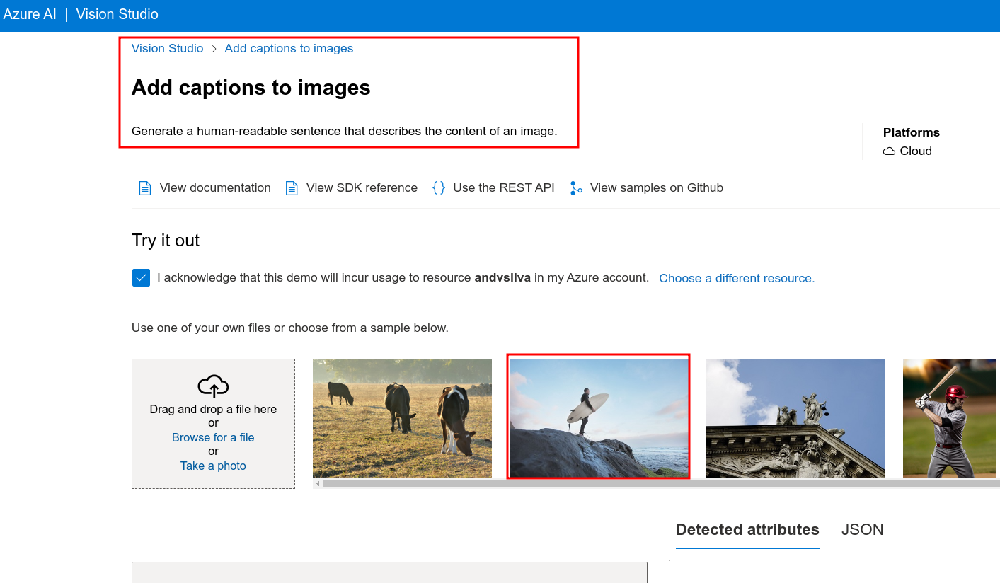

### Exemplos:

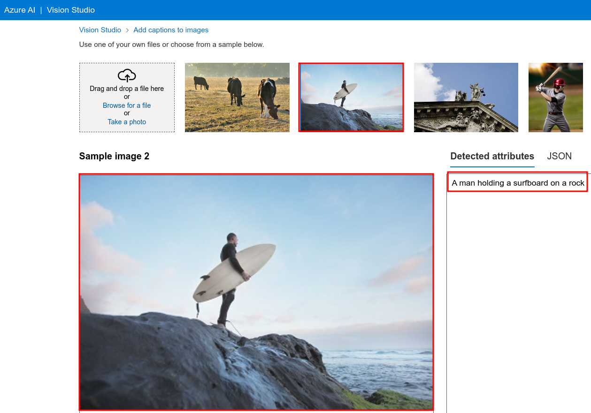